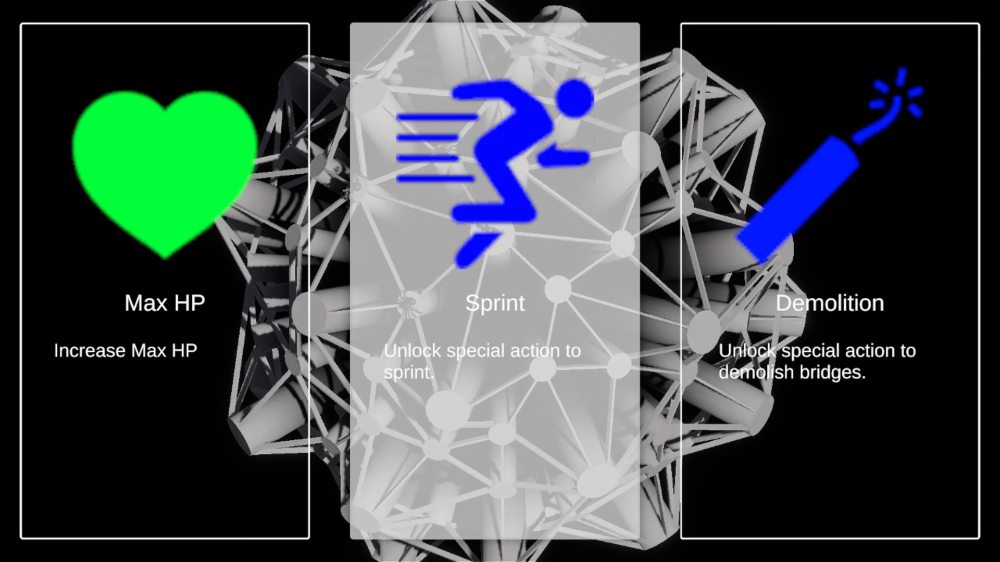
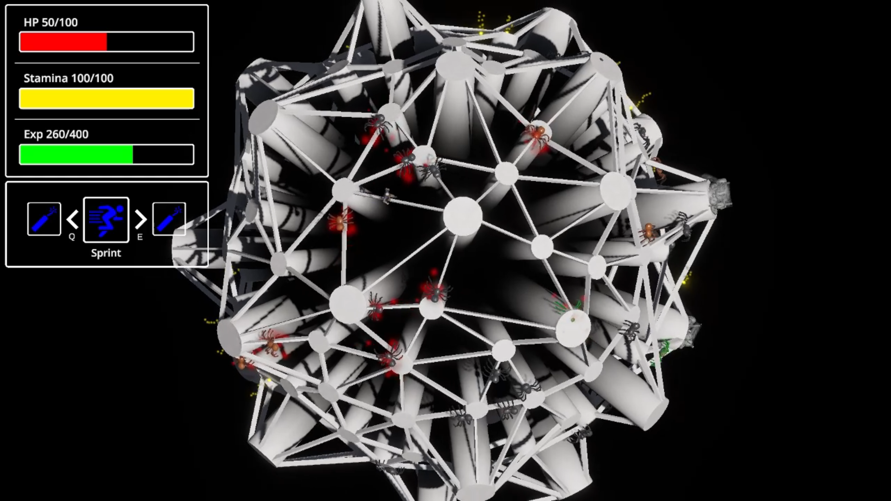
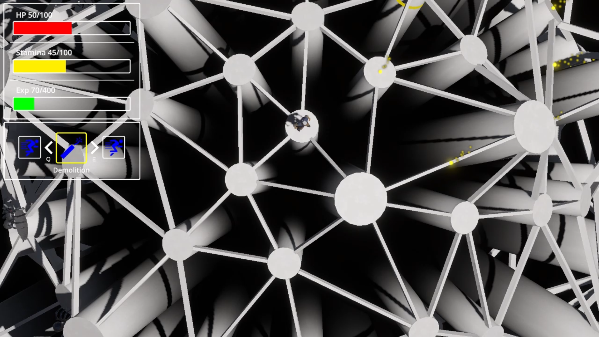

# Spider

## 1. Overview
Spider is a turn-based roguelite escape game inspired by a mini game of Cube Escape.  
The player has **no combat abilities** and must escape from pursuing enemies using facilities, special actions, and graph-based map movement.

- **Genre:** Turn-based / Roguelite / Puzzle
- **Development Period:** 2025
- **Team:** Solo (Design, Programming, Art Integration, UI/UX, Audio)  
- **Engine:** Unity  
- **Platform:** WebGL

This project was built as a portfolio piece to demonstrate system design, architecture, and problem-solving ability in Unity and C#.

---

## 2. Key Features
- **Graph-based procedural map generation** featuring pillars, bridges, and structural variation  
- **Enemy AI** that tracks the player using custom logic and reacts to movement each turn  
- **Facility System** enabling installation of utility structures  
- **Special Actions** providing momentary escape or movement options  
- **Difficulty Curve & Spawn Algorithm** controlling tension escalation  
- **Audio System** with BGM management and spatial 3D sound behavior  
- **Visual Effects** implemented through MaterialPropertyBlock and Shader Graph

---

## 3. Demo Video
[▶ Watch the Demo on YouTube](https://youtu.be/ZWTfmbNZTss) 

---

## 4. Screenshots

  
  

  
  

---

## 5. Tech Stack
- **Engine:** Unity 6  
- **Language:** C#  
- **Tools:** Git, Visual Studio Code  
- **Assets:** Imported 3D models from Unity Asset Store 
- **Other:** Shader Graph, TMP UI, MaterialPropertyBlock

---

## 6. Implemented Systems (Summary)

### ● Map Generation System
A procedural generator that assembles pillar structures, bridge connections, and height variations.  
Bugs such as incorrect bridge orientation and unnatural pillar placement were resolved through iterative logic refinement.

### ● Enemy AI (Pursuers)
Enemies evaluate the player’s position each turn and move according to a custom chase algorithm.  
Handled issues such as destroyed-object references (`MissingReferenceException`) and improved state handling.

### ● Facility System
The player can obtain and install facilities with various gameplay effects.  
Includes installation rules, activation effects, and turn-based timing.

### ● Special Actions
Implements additional player abilities such as quick movement or temporary escape tools.  
Structured to integrate cleanly with the action system and turn flow.

### ● Audio System
A lightweight AudioManager (BGM + SFX).  
Solved spatial audio issues such as 3D attenuation inconsistencies and disabled AudioSource behavior.

### ● Visual Effects / Shader Logic
Implemented feedback effects using **MaterialPropertyBlock**, enabling per-instance control without material instancing.  
Built custom emission-based effects, blinking rings, and facility visuals using Shader Graph.

### ● Game Loop & Turn Controller
Central logic that processes movement, enemy updates, facility effects, and turn sequencing.

For detailed explanations, see the Architecture Document.

---

## 7. Documentation
- **Architecture Document:** [Architecture Document](Architecture.md)

These documents include implementation details, reasoning behind decisions, system diagrams, and debugging records.

---

## 8. How to Play
You can play the WebGL build directly on itch.io:

👉 **Play on itch.io:** https://mintghost.itch.io/spider

### Controls
**Camera**
- **W / A / S / D:** Rotate the map  
- **Mouse Wheel:** Zoom in/out  
- **R:** Reset the camera so the player returns to the center of the screen  

**Movement**
- **Mouse Left Click:** Move the player by clicking a connected pillar  

**Actions**
- **Space:** Activate the special action (if available)

Survive by placing facilities strategically and avoiding pursuing enemies.

---

## 9. Development Retrospective
- Improved understanding of Unity’s material system, MPB usage, and shader workflows  
- Designed and implemented a modular architecture covering map generation, AI, turn management, and audio  
- Solved several engine-level issues related to collision events, destroyed references, and spatial audio behavior  
- Gained experience balancing a turn-based pursuit system with procedural maps  
- Refactored multiple systems to reduce component coupling as the project expanded  
- Future plans include expanded enemy types, additional facilities, enhanced visual polish, and full playtesting feedback integration

---

## 10. Contact
- **Email:** sadgabriel@protonmail.com
- **GitHub:** https://github.com/sadgabriel
